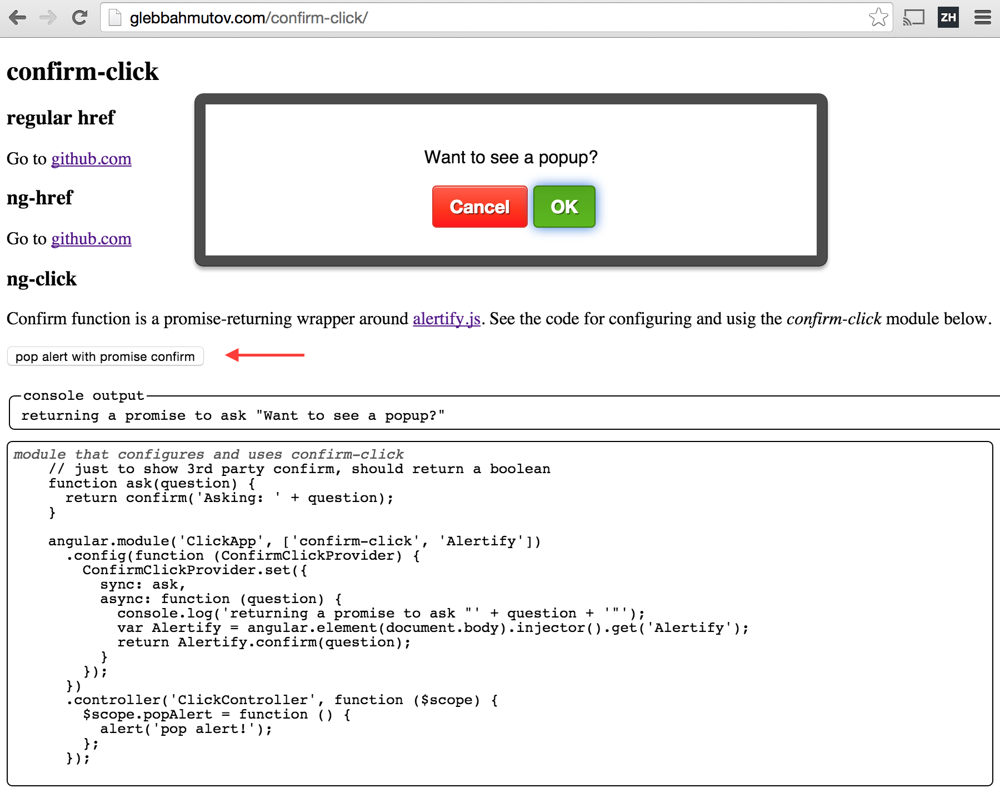

# confirm-click

> Angular directive for simple href or ng-click confirmation before proceeding

```html
<a href="http://github.com" confirm-click="Go to github?">github.com</a>
```

[Demo](http://glebbahmutov.com/confirm-click/)

[![NPM][confirm-click-icon] ][confirm-click-url]

[![Build status][confirm-click-ci-image] ][confirm-click-ci-url]
[![dependencies][confirm-click-dependencies-image] ][confirm-click-dependencies-url]
[![devdependencies][confirm-click-devdependencies-image] ][confirm-click-devdependencies-url]

## Install and use

1. `npm install confirm-click --save`
2. Include `node_modules/confirm-click/confirm-click.js` 
3. Add `confirm-click` module dependency to your app

### Confirming ng-click

Works with regular boolean- or promise-returning functions.

```html
<button ng-click="popAlert()" confirm-click="Want to see a popup?">pop alert</button>
```

### Configure custom popup function

Use `ConfirmClickProvider` function to set `ask` function. This function
will be used for `href` and `ng-href` confirmation.

```html
<script>
// just to show 3rd party confirm, should return a boolean
function ask(question) {
  return confirm(question);
}
angular.module('ClickApp', ['confirm-click'])
  .config(function (ConfirmClickProvider) {
    ConfirmClickProvider.ask(ask);
  });
</script>
<a ng-href="http://github.com" confirm-click="Go to github?">github.com</a>
```

### Custom popup function for ng-click

Can return a promise, should resolve with `false` to stop the action, or with true to continue.
For example to use [alertify.js](http://fabien-d.github.io/alertify.js/) to confirm, we can use

```html
<script>
angular.module('ClickApp', ['confirm-click'])
  .config(function (ConfirmClickProvider) {
    ConfirmClickProvider.ask(function (question) {
      return new Promise(function (resolve) {
        alertify.confirm(question, resolve);
      });
    });
  })
</script>
<button ng-click="popAlert()" confirm-click="Want to see a popup?">pop alert</button>
```

A good library wrapping alertify into promise-returning methods is 
[kensho/ng-alertify](https://github.com/kensho/ng-alertify).

See [demo](http://glebbahmutov.com/confirm-click/) page for live example.



### Small print

Author: Gleb Bahmutov &copy; 2015

* [@bahmutov](https://twitter.com/bahmutov)
* [glebbahmutov.com](http://glebbahmutov.com)
* [blog](http://bahmutov.calepin.co/)

License: MIT - do anything with the code, but don't blame me if it does not work.

Spread the word: tweet, star on github, etc.

Support: if you find any problems with this module, email / tweet /
[open issue](https://github.com/bahmutov/confirm-click/issues) on Github

## MIT License

Copyright (c) 2015 Gleb Bahmutov

Permission is hereby granted, free of charge, to any person
obtaining a copy of this software and associated documentation
files (the "Software"), to deal in the Software without
restriction, including without limitation the rights to use,
copy, modify, merge, publish, distribute, sublicense, and/or sell
copies of the Software, and to permit persons to whom the
Software is furnished to do so, subject to the following
conditions:

The above copyright notice and this permission notice shall be
included in all copies or substantial portions of the Software.

THE SOFTWARE IS PROVIDED "AS IS", WITHOUT WARRANTY OF ANY KIND,
EXPRESS OR IMPLIED, INCLUDING BUT NOT LIMITED TO THE WARRANTIES
OF MERCHANTABILITY, FITNESS FOR A PARTICULAR PURPOSE AND
NONINFRINGEMENT. IN NO EVENT SHALL THE AUTHORS OR COPYRIGHT
HOLDERS BE LIABLE FOR ANY CLAIM, DAMAGES OR OTHER LIABILITY,
WHETHER IN AN ACTION OF CONTRACT, TORT OR OTHERWISE, ARISING
FROM, OUT OF OR IN CONNECTION WITH THE SOFTWARE OR THE USE OR
OTHER DEALINGS IN THE SOFTWARE.

[confirm-click-icon]: https://nodei.co/npm/confirm-click.png?downloads=true
[confirm-click-url]: https://npmjs.org/package/confirm-click
[confirm-click-ci-image]: https://travis-ci.org/bahmutov/confirm-click.png?branch=master
[confirm-click-ci-url]: https://travis-ci.org/bahmutov/confirm-click
[confirm-click-dependencies-image]: https://david-dm.org/bahmutov/confirm-click.png
[confirm-click-dependencies-url]: https://david-dm.org/bahmutov/confirm-click
[confirm-click-devdependencies-image]: https://david-dm.org/bahmutov/confirm-click/dev-status.png
[confirm-click-devdependencies-url]: https://david-dm.org/bahmutov/confirm-click#info=devDependencies
